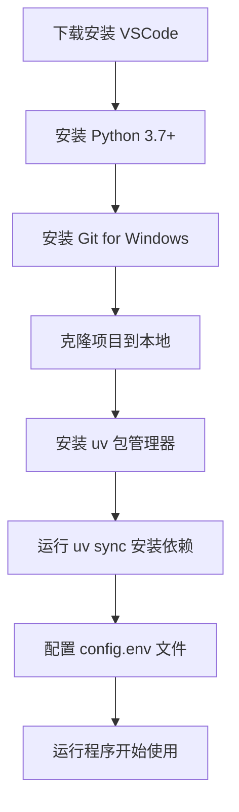

<div align="center">
  <h1>🤖 AI 聊天客户端测试工具</h1>
  <p>支持多AI供应商的聊天测试工具（Dify、OpenAI、iFlow）</p>
  
  
  
  
</div>

---

## ✨ 功能特性

- 🌐 **多AI供应商支持** - 集成 Dify、OpenAI 兼容接口、iFlow
- 💬 **实时对话模式** - 支持多轮对话，上下文维护
- 📊 **批量询问模式** - Excel 批量处理，实时保存结果
- 📝 **详细日志记录** - 完整的操作记录和错误追踪
- 🎨 **美观终端界面** - 基于 Rich 库的现代化 CLI

## 🚀 快速开始

### 安装依赖

```bash
# 使用 uv（推荐）
uv sync

# 或使用 pip
pip install requests openpyxl colorama rich
```

### 运行程序

```bash
uv run python main.py
```

### 配置设置

```bash
# 复制配置模板
cp config.env.example config.env

# 编辑配置文件
# 设置 API 密钥、角色列表等
```

## 🎯 支持的AI供应商

### 1. Dify

| 特性 | 说明 |
|------|------|
| 🏢 **平台类型** | 专业的LLM应用开发平台 |
| 🔒 **部署方式** | 支持云服务和私有化部署 |
| 🔑 **API格式** | `app-xxxxx` |
| 🌐 **官网** | [https://cloud.dify.ai](https://cloud.dify.ai) |

### 2. OpenAI 兼容接口

| 特性 | 说明 |
|------|------|
| 🔌 **兼容性** | 适配任何OpenAI格式的API |
| 🌍 **自定义URL** | 支持私有化部署地址 |
| 🤖 **模型支持** | 支持自定义模型名称 |
| 📡 **API格式** | 标准 OpenAI Chat Completions |

### 3. iFlow

| 特性 | 说明 |
|------|------|
| 🚀 **平台类型** | 集成多种模型的AI平台 |
| 🔗 **预设URL** | `https://apis.iflow.cn/v1` |
| 🎯 **内置模型** | qwen3-max, kimi-k2-0905, glm-4.6, deepseek-v3.2 |
| 📱 **获取密钥** | [iFlow控制台](https://platform.iflow.cn) |

## 💻 运行模式

### 会话模式
```bash
# 启动后选择 1
✅ 实时多轮对话
✅ 上下文自动维护
✅ 命令控制：
   - exit: 退出程序
   - /new: 重置对话
```

### 批量询问模式
```bash
# 启动后选择 2
📁 从Excel文件读取问题
🚀 批量发送到AI供应商
💾 实时写入结果到Excel
📊 生成详细日志文件
```

## 📂 项目结构

```
dify_chat_tester/
├── main.py                    # 主程序入口
├── dify_chat_tester/          # 核心模块
│   ├── ai_providers.py        # AI供应商实现
│   ├── config_loader.py       # 配置管理
│   └── terminal_ui.py         # 终端界面
├── config.env.example         # 配置模板
├── pyproject.toml            # 项目配置
└── README.md                 # 项目文档
```

## 📝 日志文件

| 模式 | 文件名 | 内容 |
|------|--------|------|
| 🗣️ 会话模式 | `chat_log.xlsx` | 对话记录、时间戳、状态 |
| 📊 批量模式 | `batch_query_log_YYYYMMDD_HHMMSS.xlsx` | 详细操作日志、错误追踪 |

## ⚙️ 配置说明

主要配置项（config.env）：

```bash
# 角色配置
ROLES=员工,门店,管理员

# 批量处理间隔（秒）
BATCH_REQUEST_INTERVAL=1.0

# iFlow 模型列表
IFLOW_MODELS=qwen3-max,kimi-k2-0905,glm-4.6,deepseek-v3.2

# OpenAI 模型列表
OPENAI_MODELS=gpt-4o,gpt-4o-mini,gpt-3.5-turbo

# 等待动画
WAITING_INDICATORS=⣾,⣽,⣻,⢿,⡿,⣟,⣯,⣷
```

## 🛠️ 开发

### 代码检查

```bash
# 代码格式检查
uv run ruff check .

# 自动修复
uv run ruff check --fix .
```

### 测试

```bash
# 运行测试（如果有）
uv run pytest
```

## 📄 许可证

本项目采用 [MIT 许可证](LICENSE)

## 👨‍💻 作者

**Mison** - <1360962086@qq.com>

[GitHub](https://github.com/MisonL) | [邮箱](mailto:1360962086@qq.com)

---

---

## 📚 用户使用指南

### 🌟 新手必读：从零开始安装教程

我们为您准备了详细的[**用户使用指南**](用户使用指南.md)，帮助您从零开始安装和使用本工具。

#### 📋 快速导航

| 章节 | 内容 | 适用人群 |
|------|------|----------|
| 📋 [准备工作](用户使用指南.md#1-准备工作) | 系统要求和环境检查 | 所有用户 |
| 📝 [安装 VSCode](用户使用指南.md#2-安装-vscode) | 代码编辑器安装配置 | 新手用户 |
| 🐍 [安装 Python](用户使用指南.md#3-安装-python) | Python 环境搭建 | 所有用户 |
| 📦 [安装 Git](用户使用指南.md#4-安装-git-for-windows) | 版本控制工具安装 | 所有用户 |
| 🚀 [克隆项目](用户使用指南.md#5-克隆项目) | 获取项目代码 | 所有用户 |
| ⚙️ [安装依赖](用户使用指南.md#7-安装-uv-包管理器) | 环境配置和依赖安装 | 所有用户 |
| 🎮 [使用方法](用户使用指南.md#9-程序使用方法) | 程序运行和功能说明 | 所有用户 |
| ❓ [常见问题](用户使用指南.md#10-常见问题) | 问题排查和解决方案 | 遇到问题的用户 |

#### 💡 核心步骤概览



#### 🎯 特别提醒

- ℹ️ **Python PATH**：本项目使用 uv 管理 Python 环境，无需勾选 "Add Python to PATH" 也能正常运行
- 💻 **推荐**：设置 VSCode 默认终端为 Git Bash
- 🔑 **安全**：不要在配置文件中硬编码 API 密钥
- 📝 **建议**：首次使用请先阅读[程序使用方法](用户使用指南.md#9-程序使用方法)

**👉 [查看完整用户使用指南](用户使用指南.md)**

### 📑 快速导航

| 章节 | 内容 | 适用人群 |
|------|------|----------|
| 📋 [准备工作](用户使用指南.md#1-准备工作) | 系统要求和环境检查 | 所有用户 |
| 📝 [安装 VSCode](用户使用指南.md#2-安装-vscode) | 代码编辑器安装配置 | 新手用户 |
| 🐍 [安装 Python](用户使用指南.md#3-安装-python) | Python 环境搭建 | 所有用户 |
| 📦 [安装 Git](用户使用指南.md#4-安装-git-for-windows) | 版本控制工具安装 | 所有用户 |
| 🚀 [克隆项目](用户使用指南.md#5-克隆项目) | 获取项目代码 | 所有用户 |
| ⚙️ [安装依赖](用户使用指南.md#7-安装-uv-包管理器) | 环境配置和依赖安装 | 所有用户 |
| 🎮 [使用方法](用户使用指南.md#9-程序使用方法) | 程序运行和功能说明 | 所有用户 |
| ❓ [常见问题](用户使用指南.md#10-常见问题) | 问题排查和解决方案 | 遇到问题的用户 |

### 💡 核心步骤概览


### 🎯 特别提醒

- ℹ️ **Python PATH**：本项目使用 uv 管理 Python 环境，无需勾选 "Add Python to PATH" 也能正常运行
- 💻 **推荐**：设置 VSCode 默认终端为 Git Bash
- 🔑 **安全**：不要在配置文件中硬编码 API 密钥
- 📝 **建议**：首次使用请先阅读[程序使用方法](用户使用指南.md#9-程序使用方法)

---

<div align="center">
  <p>⭐ 如果这个项目对你有帮助，请给个 Star！</p>
  <p>🤝 欢迎提交 Issue 和 Pull Request</p>
</div>