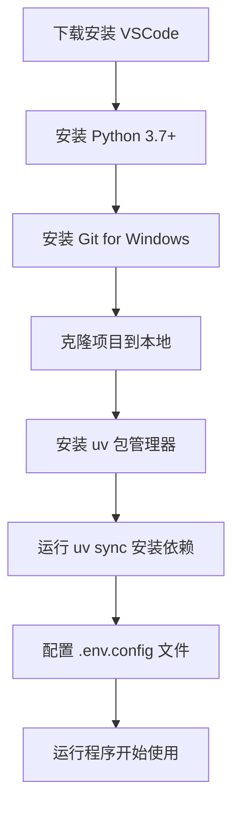

<div align="center">
  <h1>🤖 AI 聊天客户端测试工具</h1>
  <p>支持多AI供应商的聊天测试工具（Dify、OpenAI、iFlow） v1.3.2</p>
  
  
  
  
</div>

---

## ✨ 功能特性

- 🌐 **多 AI 供应商支持** - 集成 Dify、OpenAI 兼容接口、iFlow
- 💬 **实时对话模式** - 支持多轮对话，智能上下文维护
- 📊 **批量询问模式** - Excel 批量处理，实时保存结果
- 🤖 **AI 生成测试问题** - 智能分析文档，自动生成测试提问点
- 📝 **智能日志系统** - 日志轮转、权限自适应、完整错误追踪
- 🎨 **美观终端界面** - 基于 Rich 库的现代化 CLI，流式输出优化
- 🔐 **安全输入** - API 密钥自动隐藏，配置文件保护
- 🔄 **灵活配置** - 支持配置文件和交互式输入双模式

## 🚀 快速开始

### 安装依赖

```bash
# 使用 uv（推荐）
uv sync

# 或使用 pip
pip install requests openpyxl colorama rich
```

### 运行程序

```bash
# 交互式模式（默认）
uv run python main.py

# 直接进入 "AI 生成测试提问点" 功能
uv run python main.py -- --mode question-generation

# 指定文档目录（跳过目录选择）
uv run python main.py -- --mode question-generation --folder ./kb-docs
```

### 配置设置

```bash
# 复制配置模板（推荐做法）
cp .env.config.example .env.config

# 编辑配置文件
# 设置 API 密钥、角色列表等
```

> 提示：如果在没有 `.env.config` 的情况下直接运行程序，
> 工具会在程序所在目录自动创建一个默认的 `.env.config`：
>
> - 若存在 `.env.config.example`，会基于该模板生成；
> - 若不存在模板，则按照内置默认值生成一个基础配置文件；
> - 创建过程中的提示会显示在终端（stderr），首次运行后建议立即打开并修改该文件。

## 🎯 支持的 AI 供应商

### 1. Dify

| 特性            | 说明                                           |
| --------------- | ---------------------------------------------- |
| 🏢 **平台类型** | 专业的 LLM 应用开发平台                        |
| 🔒 **部署方式** | 支持云服务和私有化部署                         |
| 🔑 **API 格式** | `app-xxxxx`                                    |
| 🌐 **官网**     | [https://cloud.dify.ai](https://cloud.dify.ai) |
| 🎯 **特色**     | 无需选择模型，直接使用应用 ID                  |

### 2. OpenAI 兼容接口

| 特性              | 说明                         |
| ----------------- | ---------------------------- |
| 🔌 **兼容性**     | 适配任何 OpenAI 格式的 API   |
| 🌍 **自定义 URL** | 支持私有化部署地址           |
| 🤖 **模型支持**   | 支持自定义模型名称           |
| 📡 **API 格式**   | 标准 OpenAI Chat Completions |

### 3. iFlow（推荐）

| 特性            | 说明                                                         |
| --------------- | ------------------------------------------------------------ |
| 🚀 **平台类型** | 集成多种模型的 AI 平台                                       |
| 🔗 **预设 URL** | `https://apis.iflow.cn/v1`                                   |
| 🎯 **内置模型** | qwen3-max, kimi-k2-0905, glm-4.6, deepseek-v3.2              |
| 📱 **获取密钥** | [iFlow 控制台](https://platform.iflow.cn/profile?tab=apiKey) |
| ⭐ **推荐理由** | 稳定性好、响应速度快、支持多种主流模型                       |

## 🎨 AI 提示词自定义（高级功能）

本工具支持自定义 AI 系统提示词，您可以调整 AI 助手的对话风格和行为：

### 配置方式

在 `.env.config` 文件中设置 `SYSTEM_PROMPT` 参数：

```ini
# AI 提示词配置
# 支持占位符: {role}
SYSTEM_PROMPT=你是一个AI助手。当前角色：{role}。请以专业、友好的方式回答问题。
```

### 使用场景

- 👔 **专业领域**：让 AI 扮演特定领域专家（如电商、医疗、技术支持）
- 📝 **回答风格**：调整 AI 的回答详细程度和语气
- 🌐 **多语言**：切换到英文或其他语言
- 🎯 **特殊要求**：添加安全、合规等特定约束

### 示例

```ini
# 电商客服专家
SYSTEM_PROMPT=你是一个专注于电商领域的{role}。你了解电商运营、客户服务的最佳实践。请以友好、专业的方式回答问题。

# 技术支持专家
SYSTEM_PROMPT=你是一个IT技术支持{role}。你精通常见的技术问题排查方法，能够用通俗易懂的语言解释技术概念。请耐心、详细地回答问题。

# 简洁风格
SYSTEM_PROMPT=你是{role}，请用简洁明了的语言回答问题，避免冗长的解释。每个回答控制在3-5句话以内。
```

详细配置说明请参考：[AI_PROMPT_CONFIG.md](docs/AI_PROMPT_CONFIG.md)

## 💻 运行模式

本工具提供两大主功能：

### 功能 1️⃣：AI 问答测试

**运行方式：** 启动后选择功能 `1`

#### 模式 1. 会话模式

```bash
# 在 AI问答测试 中选择 1
✅ 实时多轮对话
✅ 上下文自动维护
✅ 命令控制：
   - /help        查看可用命令说明
   - /exit,/quit  返回模式选择
   - /new         重置对话上下文
✅ 退出时静默返回，无额外提示
```

#### 模式 2. 批量询问模式

```bash
# 在 AI问答测试 中选择 2
📁 从 Excel 文件读取问题
🚀 批量发送到 AI 供应商
💾 实时写入结果到 Excel
📊 进度条显示处理状态
📈 生成详细统计信息
```

### 功能 2️⃣：AI 生成测试提问点

**运行方式：** 启动后选择功能 `2`

```bash
📂 读取指定目录下的 Markdown 文档
🤖 AI 智能分析文档内容
❓ 自动生成高质量测试问题
💾 导出为 Excel 文件（带美化表头）
⚡ 支持增量保存，避免进度丢失
```

## 📂 项目结构

```
dify_chat_tester/
├── main.py                    # 主程序入口（简洁委托）
├── dify_chat_tester/          # 核心模块
│   ├── app_controller.py      # 应用控制器
│   ├── chat_manager.py        # 聊天管理器
│   ├── batch_manager.py       # 批量管理器
│   ├── question_generator.py  # 问题生成器
│   ├── provider_setup.py      # 供应商设置
│   ├── plugin_manager.py      # 插件管理器
│   ├── selectors.py           # 选择器
│   ├── ai_providers.py        # AI供应商基类
│   ├── config_loader.py       # 配置管理
│   ├── terminal_ui.py         # 终端界面
│   ├── excel_utils.py         # Excel工具
│   ├── logging_utils.py       # 日志工具
│   └── plugins/               # 插件目录
│       ├── dify/              # Dify 供应商插件
│       ├── openai_compat/     # OpenAI 兼容接口插件
│       └── iflow/             # iFlow 供应商插件
├── docs/
│   ├── PLUGIN_GUIDE.md        # 插件开发指南
│   └── ...
├── .env.config.example        # 配置模板
├── pyproject.toml             # 项目配置
└── README.md                  # 项目文档
```

## 📝 日志文件

| 模式              | 文件名                                     | 内容                               |
| ----------------- | ------------------------------------------ | ---------------------------------- |
| 🗣️ 会话模式       | `chat_log.xlsx`                            | 对话记录、时间戳、状态             |
| 📊 批量模式       | `batch_query_log_YYYYMMDD_HHMMSS.xlsx`     | 批量询问结果、详细操作日志         |
| 🤖 问题生成模式   | `question_generation_YYYYMMDD_HHMMSS.xlsx` | AI 生成的测试问题、文档名称对应    |
| 📋 系统日志(可选) | `dify_chat_tester.log`                     | 程序运行日志（需开启 LOG_TO_FILE） |

## ⚙️ 配置说明

主要配置项（.env.config）：

```bash
# === 文件配置 ===
CHAT_LOG_FILE_NAME=chat_log.xlsx

# === 角色配置 ===
ROLES=员工,门店,管理员

# === 批量处理配置 ===
BATCH_REQUEST_INTERVAL=1.0           # 批量请求间隔（秒）
BATCH_DEFAULT_SHOW_RESPONSE=true     # 是否默认显示批量回答

# === 网络重试配置 ===
# 仅在出现网络超时/连接错误时重试
NETWORK_MAX_RETRIES=3                # 每次请求的最大重试次数
NETWORK_RETRY_DELAY=1.0              # 重试之间的等待时间（秒）

# === AI 模型配置 ===
IFLOW_MODELS=qwen3-max,kimi-k2-0905,glm-4.6,deepseek-v3.2
OPENAI_MODELS=gpt-4o,gpt-4o-mini,gpt-3.5-turbo

# === 等待动画配置 ===
WAITING_INDICATORS=⣾,⣽,⣻,⢿,⡿,⣟,⣯,⣷
WAITING_TEXT=正在思考
WAITING_DELAY=0.1

# === 终端 UI 配置 ===
USE_RICH_UI=true                     # true 使用 Rich 彩色面板，false 使用简单文本
ENABLE_THINKING=true                 # 是否默认开启思维链/推理过程

# === 日志配置 ===
LOG_LEVEL=INFO                       # DEBUG/INFO/WARNING/ERROR/CRITICAL
LOG_TO_FILE=false                    # 是否写入日志文件
LOG_FILE_NAME=dify_chat_tester.log   # 日志文件名
# LOG_DIR=logs                       # 日志目录（可选，默认 logs）
# LOG_MAX_BYTES=10485760             # 单个日志文件最大字节数（默认 10MB）
# LOG_BACKUP_COUNT=5                 # 保留的备份文件数量（默认 5）

# === Provider 连接配置（可选） ===
# 未配置则在程序中交互输入
# DIFY_BASE_URL=https://api.dify.ai/v1
# DIFY_API_KEY=app-xxx
# DIFY_APP_ID=your-app-id
# OPENAI_BASE_URL=https://api.openai.com/v1
# OPENAI_API_KEY=sk-xxx
# IFLOW_API_KEY=sk-xxx
```

## 🔗 与 Semantic Tester 协同使用

本项目可与 [semantic_tester](https://github.com/MisonL/semantic_tester) 配合使用，形成完整的 AI 客服测试闭环：

### 完整工作流程


### 快速开始

#### 步骤 1: 生成测试问题

```bash
cd dify_chat_tester
uv run python main.py -- --mode question-generation --folder ./kb-docs
# 输出: question_generation_YYYYMMDD_HHMMSS.xlsx
```

#### 步骤 2: 批量询问 AI

```bash
uv run python main.py
# 选择批量模式，使用上一步生成的 Excel 文件
# 输出: batch_query_log_YYYYMMDD_HHMMSS.xlsx
```

#### 步骤 3: 语义比对

```bash
cd ../semantic_tester
uv run python main.py
# 选择上一步的批量结果文件
# 程序会自动检测格式并进行语义比对
# 输出: 在原 Excel 中新增"语义是否相符"和"判断依据"列
```

### 主要优势

- 🚀 **自动化流程**: 从问题生成到语义评估，全流程自动化
- 📊 **数据追溯**: Excel 文件贯穿整个流程，便于追溯和分析
- 🎯 **精准评估**: 结合 AI 回答和知识库进行语义层面的质量评估
- 🔄 **持续优化**: 通过评估结果改进知识库，形成闭环

### 详细说明

参见完整的[协同使用指南](docs/用户使用指南.md#与-semantic-tester-协同使用)

## 🛠️ 开发

### 代码检查

```bash
# 代码格式检查
uv run ruff check .

# 自动修复
uv run ruff check --fix .

# 代码格式化
uv run black .
uv run isort .
```

### 测试

```bash
# 运行测试（如果有）
uv run pytest
```

## 📄 许可证

本项目采用 [MIT 许可证](LICENSE)

## 👨‍💻 作者

**Mison** - <1360962086@qq.com>

[GitHub](https://github.com/MisonL) | [邮箱](mailto:1360962086@qq.com)

---

## 📚 用户使用指南

### 🌟 新手必读：从零开始安装教程

我们为您准备了详细的[**用户使用指南**](docs/用户使用指南.md)，帮助您从零开始安装和使用本工具。

#### 📋 快速导航

| 章节                                                       | 内容               | 适用人群       |
| ---------------------------------------------------------- | ------------------ | -------------- |
| 📋 [准备工作](docs/用户使用指南.md#1-准备工作)             | 系统要求和环境检查 | 所有用户       |
| 📝 [安装 VSCode](docs/用户使用指南.md#2-安装-vscode)       | 代码编辑器安装配置 | 新手用户       |
| 🐍 [安装 Python](docs/用户使用指南.md#3-安装-python)       | Python 环境搭建    | 所有用户       |
| 📦 [安装 Git](docs/用户使用指南.md#4-安装-git-for-windows) | 版本控制工具安装   | 所有用户       |
| 🚀 [克隆项目](docs/用户使用指南.md#5-克隆项目)             | 获取项目代码       | 所有用户       |
| ⚙️ [安装依赖](docs/用户使用指南.md#7-安装-uv-包管理器)     | 环境配置和依赖安装 | 所有用户       |
| 🎮 [使用方法](docs/用户使用指南.md#9-程序使用方法)         | 程序运行和功能说明 | 所有用户       |
| ❓ [常见问题](docs/用户使用指南.md#10-常见问题)            | 问题排查和解决方案 | 遇到问题的用户 |

#### 💡 核心步骤概览



#### 🎯 特别提醒

- ℹ️ **Python PATH**：本项目使用 uv 管理 Python 环境，无需勾选 "Add Python to PATH" 也能正常运行
- 💻 **推荐**：设置 VSCode 默认终端为 Git Bash
- 🔑 **安全**：不要在配置文件中硬编码 API 密钥
- 🧠 **思维链**：默认开启 AI 思考过程显示，可通过配置文件中的 `ENABLE_THINKING` 参数关闭
- 📝 **建议**：首次使用请先阅读[程序使用方法](docs/用户使用指南.md#9-程序使用方法)

**👉 [查看完整用户使用指南](docs/用户使用指南.md)**

---

<div align="center">
  <p>⭐ 如果这个项目对你有帮助，请给个 Star！</p>
  <p>🤝 欢迎提交 Issue 和 Pull Request</p>
</div>
